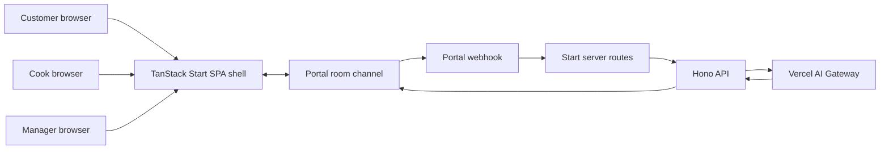

# Kitchen Chaos Realtime

## Product and technical design

**Date:** 2026-08-08

**Status:** Pending human review. Revised for TanStack Start SPA mode, Nitro on Vercel, Hono API adapters, Oxc tooling, and mise-managed Node/pnpm.

**Scope:** Hackathon MVP that people can test after the demo

## 1. Goal

Kitchen Chaos is a shared realtime kitchen for three human roles and three AI agents.

The product must prove these points:

1. Several people connect to the same room.
2. Each person has a different role.
3. All people see one shared kitchen state.
4. Portal stores the kitchen event stream.
5. AI agents react to that shared event stream.
6. A change from one browser appears in the other browsers at once.

The central product moment is short.
A Customer creates two orders.
A Manager fails the Principal station.
The Backup agent reassigns affected orders.
A Cook marks one order ready.
The Delivery agent completes it.
Every browser shows the same result.

## 2. Product principles

- Portal is the only source of truth for kitchen state.
- Browsers can store temporary form and display state only.
- The Hono backend does not store kitchen state between requests.
- The product uses a small number of clear agents.
- The product supports several active orders.
- The demo path must also work when the model fails.
- The role views must make the multiplayer value visible.
- The implementation must serve the 90-second demo first.

## 3. Scope

### 3.1 Human roles

| Role     | Main action                                | Main view                                  |
| -------- | ------------------------------------------ | ------------------------------------------ |
| Customer | Creates orders                             | Menu and status of their orders            |
| Cook     | Selects an active order and marks it ready | Cooking queue grouped by station           |
| Manager  | Triggers a Principal station failure       | Full board, stations, agents, and presence |

The join screen asks for a name, a room code, and a role. The MVP has no account or login flow.

The selected role controls the visible interface. It is a product boundary, not a security boundary. Portal presence metadata contains the display name and role.

All role views filter the same room projection. A role does not create or store a separate kitchen state.

### 3.2 AI agents

| Agent       | Trigger          | Action                                   |
| ----------- | ---------------- | ---------------------------------------- |
| Coordinator | `order.created`  | Assigns a station and a priority         |
| Backup      | `station.failed` | Reassigns each affected order to Reserve |
| Delivery    | `order.ready`    | Marks the order delivered                |

Each agent writes one short operational explanation. The product does not show private chain-of-thought or long reasoning.

### 3.3 Implemented chaos event

The MVP implements only `station.failed`. The Manager can fail the Principal station.

The event model uses a typed chaos event union. A small dispatcher handles the event. This keeps later chaos types possible without building a plugin system now.

## 4. Out of scope

- Accounts, passwords, and secure role authorization
- An external database, cache, or queue
- Long-term model memory or conversation memory
- Portal Extensions and Extension snapshots
- LangChain, LangGraph, AWS Strands, or another agent framework
- `ToolLoopAgent` or an autonomous tool loop
- More than one model gateway in the MVP
- Express
- A plain static Vite frontend without TanStack Start
- Independent Vercel Function files under `api/` for the webhook or health routes
- A generic host rewrite of all routes to `index.html`
- ESLint or Prettier
- Inventory, maps, delivery routes, or ingredient search
- Chat between humans
- Ambient orders, fake viewers, and local progression timers
- Secondary metrics, analytics, and observability platforms
- More chaos events in the hackathon MVP
- Automated browser or multi-device test infrastructure

## 5. Technology baseline

The implementation ignores the current package dependency versions in the repository. It uses the latest stable compatible versions at implementation time, with the release-candidate exception below.

The repository mise configuration remains authoritative for Node.js 24 and pnpm. Package `engines` must match the mise Node major. Workers must not replace, repin, or abandon the user-managed mise configuration.

| Area             | Decision                                                                 |
| ---------------- | ------------------------------------------------------------------------ |
| Runtime          | Node.js 24 LTS via repository mise configuration                         |
| Package manager  | pnpm only, via repository mise configuration                             |
| Language         | TypeScript for all new and migrated code                                 |
| App framework    | TanStack Start in client-side SPA mode, with Nitro for server output     |
| UI library       | React stable and `@vitejs/plugin-react` stable                           |
| API application  | Hono as a stateless Web `fetch` app                                      |
| Hosting          | One TanStack Start and Nitro project on Vercel                           |
| Realtime         | Latest stable Portal SDK and Portal HTTP APIs                            |
| AI               | Latest stable Vercel AI SDK Core with AI Gateway by default              |
| Validation       | Latest stable Zod with Standard Schema support                           |
| Tests            | Latest stable Vitest compatible with the Vite version required by pinned Start and Nitro, and with Node.js 24 |
| Lint             | `oxlint` as a pinned development dependency                              |
| Format           | `oxfmt` as a pinned development dependency                               |

The project stores exact resolved versions in `pnpm-lock.yaml`. The project does not keep another package-manager lockfile.

### 5.1 Package stability

Use stable releases for all packages except TanStack Start and, when required, its Nitro companion.

TanStack Start is accepted as a release candidate for this project only. Pin the exact TanStack Start version and the exact Start-compatible Nitro companion version at implementation time. That Nitro pin is allowed even when the required companion is not labeled stable. Do not use beta, canary, or experimental releases for other packages.

During setup, pnpm resolves each package from its current approved release. Use an older release only after a verified compatibility failure.

### 5.2 Vite plugin order

Configure Vite plugins in this order:

1. TanStack Start
2. Nitro
3. React

Let Nitro control Vercel routing. Do not add a generic rewrite to `index.html`. TanStack Start replaces the plain Vite entry model. Treat a deleted root `index.html` as intentional.

### 5.3 Project commands

Required project commands are:

```bash
pnpm dev
pnpm typecheck
pnpm lint
pnpm lint:fix
pnpm format
pnpm format:check
pnpm test
pnpm test:watch
pnpm build
```

`pnpm typecheck` runs `tsc --noEmit` and remains authoritative for types. Do not enable Oxlint experimental type checking.

### 5.4 Lint and format

Add `oxlint` and `oxfmt` as pinned development dependencies. Do not add ESLint or Prettier.

Use Oxlint native support for React, TypeScript, Vitest, and JSX accessibility.

Commit an Oxlint config with centralized ignore patterns. Commit an Oxfmt config with centralized ignore patterns.

Ignore at least these paths in both tools:

- Generated `src/routeTree.gen.ts`
- Build output
- Vercel output
- Compiled prototype assets under `assets/`
- Temporary agent reports under `agent/tmp/`

Let Oxfmt ignore lockfiles through its default behavior.

### 5.5 Issue foundation work

Issue #1 foundation work includes all of these items:

- TanStack Start dependencies and SPA mode configuration
- Nitro Vite configuration and Vercel deploy path
- TypeScript client and server boundaries
- The health route red-green test cycle
- `createApp(deps)` for the Hono application
- Exact Start server routes for `/api/health` and `/api/portal/webhook`
- The Start route shell for join and role views
- Oxlint, Oxfmt, and committed ignore rules
- Removal of obsolete plain-Vite assets and entry assumptions
- Full verification commands
- Preservation of the user-managed repository mise configuration for Node 24 and pnpm
- A human checkpoint after the verified micro-phase is committed, pushed, and documented on GitHub

## 6. System architecture



All browsers load the TanStack Start SPA shell and join one Portal channel. The channel ID is `kitchen-<ROOM_CODE>`.

Human actions publish persistent domain events.
Portal sends those events to the Start webhook route.
That route forwards the original request to Hono.
Hono rebuilds the room projection and calls the correct AI agent.
Hono then publishes the agent event to the same channel.

The frontend and Hono import the same pure reducer. This prevents separate definitions of kitchen state.

AI SDK Core is the application-facing model API. AI Gateway is the default model backend. This choice does not require Vercel hosting.

One Vercel project hosts the TanStack Start SPA client and the Nitro server output. Hono is the API application inside that project. It is not a separate Vercel Function tree under `api/`.

The static menu can live in source code. Orders, stations, agent actions, and chaos events must live in Portal.

### 6.1 External HTTP routes

Keep all external HTTP routes under `/api`. The MVP exposes only these routes:

- `GET /api/health`
- `POST /api/portal/webhook`

Define exact TanStack Start server routes for both paths. Each route forwards the original unread Web `Request` to `honoApp.fetch(request)` and returns the Hono `Response`.

Do not parse, clone, rebuild, or log the webhook body in the Start adapter. The Hono application owns signature verification, body parsing, and error responses.

Nitro owns host routing for static assets, server routes, and the SPA shell. Do not add a Router-style catch-all rewrite to `index.html`. A catch-all that wins over `/api/*` breaks webhook delivery.

### 6.2 Client routes

Use TanStack file routes for the browser UI:

| Route                      | Purpose                                      |
| -------------------------- | -------------------------------------------- |
| `/`                        | Join screen for name, room code, and role    |
| `/room/$roomId/$role`      | Role view for Customer, Cook, or Manager     |

The role segment selects the visible interface. Portal remains the only kitchen state source. Route loaders must not hold kitchen domain state or server secrets.

Keep the root route free of secrets and user-specific data. The SPA shell is public static HTML.

## 7. Portal room model

### 7.1 Channel

Each room code maps to one Portal channel. A new room code creates a clean product session without a delete or reset operation.

The channel uses:

- Persistent messages for all domain events
- Presence for connected people, display names, and roles
- Initial history and history paging for state reconstruction
- Portal sequence numbers for canonical event order

The UI applies persistent messages in ascending sequence order. A reload rebuilds the same projection from Portal history.

### 7.2 No local domain state

The browser can keep a draft order, an open panel, and a connection indicator locally. It must not treat a local order array as authoritative.

After a human action, the UI shows the domain change only after Portal accepts and delivers its event. An optional pending indicator can cover this short interval.

### 7.3 Message size

Portal limits message content to 2 KB. Events must use short fields and short agent explanations. Events must not contain a full room projection.

A human event can include a compact `contextHint`.
Hono uses this hint only when history is temporarily unavailable.
The hint contains only the station state and affected order identifiers needed for that trigger.

## 8. Event contract

### 8.1 Common fields

Every event content has these fields:

| Field         | Meaning                                    |
| ------------- | ------------------------------------------ |
| `version`     | Contract version. The MVP uses `1`.        |
| `type`        | Domain event type                          |
| `roomId`      | Portal channel ID                          |
| `actor`       | Human or agent identity and role           |
| `payload`     | Type-specific data                         |
| `contextHint` | Optional compact recovery context for Hono |

Portal supplies the message ID, sender, timestamp, and sequence. The reducer uses the Portal sequence as the canonical order.

Every agent event also has these fields:

| Field       | Meaning                                    |
| ----------- | ------------------------------------------ |
| `causedBy`  | Portal message ID that triggered the agent |
| `actionKey` | Deterministic key for an agent action      |
| `agentRole` | `coordinator`, `backup`, or `delivery`     |
| `thought`   | Short operational explanation for the UI   |

The `actionKey` format is:

```text
<triggerId>:<agentRole>:<actionType>:<orderId>
```

### 8.2 Human events

| Event            | Author   | Required payload                                    |
| ---------------- | -------- | --------------------------------------------------- |
| `order.created`  | Customer | `orderId`, customer identity, and compact item list |
| `order.ready`    | Cook     | `orderId`                                           |
| `station.failed` | Manager  | `station: "principal"` and compact context hint     |

The client creates `orderId` with a UUID. The UI derives a short display label from it.

### 8.3 Agent events

| Event              | Author      | Required payload                                        |
| ------------------ | ----------- | ------------------------------------------------------- |
| `order.assigned`   | Coordinator | `orderId`, `station`, and `priorityScore`               |
| `order.reassigned` | Backup      | `orderId`, `station: "reserve"`, and `priorityScore: 3` |
| `order.delivered`  | Delivery    | `orderId`                                               |

The Backup agent publishes one `order.reassigned` event for each affected order. This keeps each action small and independently idempotent.

## 9. Shared reducer

The reducer is a pure TypeScript function. Its input is a projection and one Portal message. Its output is a new projection.

The projection contains:

- Orders indexed by `orderId`
- The stage, station, priority, and owner of each order
- Principal and Reserve station status
- The latest short action for each agent
- Applied Portal message IDs
- Applied agent `actionKey` values

The valid order path is:

```text
Received -> Cooking -> Ready -> Delivered
```

Reducer rules:

1. `order.created` creates an order in `Received`.
2. `order.assigned` moves it to `Cooking` and sets the station.
3. `order.reassigned` changes the station but not the stage.
4. `order.ready` moves a `Cooking` order to `Ready`.
5. `order.delivered` moves a `Ready` order to `Delivered`.
6. A failed station cannot receive a new assignment.
7. An event cannot move an order backward.
8. A duplicate Portal message ID has no effect.
9. A duplicate `actionKey` has no effect.
10. An unknown event or contract version has no effect.

The reducer does not call Portal, the model, or the clock. This keeps it deterministic and easy to test.

## 10. Priority model

`priorityScore` uses three values:

| Value | Meaning | Use                                                         |
| ----- | ------- | ----------------------------------------------------------- |
| `1`   | Low     | Large order during congestion                               |
| `2`   | Normal  | Default priority                                            |
| `3`   | High    | Quick order during congestion or an order affected by chaos |

Fewer than three active orders is not congestion. The Coordinator uses priority `2` by default in that case.

The Backup agent always gives an interrupted order priority `3`. If the model returns an invalid priority, Hono uses `2`.

Priority changes only the Cook queue order and its visual highlight. It never changes an order stage automatically.

The Cook queue sorts orders by these fields:

1. Higher priority first
2. Earlier `order.created` Portal sequence first

The Cook can select any valid order. The queue recommendation does not block a different choice.

## 11. Agent execution

The MVP does not use conversational memory. Portal history is event memory for the product, not memory inside the model.

Each agent call receives:

- The triggering event
- The current compact room projection
- The agent role and permitted action
- A strict structured-output schema

Each call returns one decision. The AI SDK validates the structured output before Hono publishes it.

### 11.1 Coordinator

The Coordinator reads a new order and the current projection. It returns `principal` or `reserve`, a priority from `1` to `3`, and one short explanation.

Hono overrides an assignment to a failed station. It sends that order to Reserve.

### 11.2 Backup

The Backup agent runs once for `station.failed`. Hono identifies active orders assigned to Principal. The agent returns a short recovery explanation.

Hono publishes one deterministic reassignment for each affected order. Each reassignment uses priority `3`.

### 11.3 Delivery

The Delivery agent reacts to `order.ready`. It returns one short explanation. Hono publishes `order.delivered` for that order.

### 11.4 Deterministic fallbacks

Each agent has a fixed fallback action. A model timeout, provider error, missing key, or invalid result activates the fallback.

- Coordinator fallback: use an available station and priority `2`.
- Backup fallback: move every affected order to Reserve with priority `3`.
- Delivery fallback: deliver the ready order.

The model improves the visible explanation and the Coordinator decision. It must not control whether the demo can finish.

### 11.5 Model provider boundary

The MVP uses AI Gateway through AI SDK Core. The server keeps model selection in one provider module. Agents receive an AI SDK language model and do not import Gateway-specific code.

Use `AI_GATEWAY_API_KEY` for authentication and `AI_MODEL` for the model identifier. A different Gateway model requires only an `AI_MODEL` change.

OpenRouter remains a later alternative. That change requires its provider adapter, API key, and possibly a different model identifier. It must not require changes to event contracts, prompts, agents, or the webhook flow.

Do not implement AI Gateway and OpenRouter together in the MVP. Two active providers add configuration and failure paths without improving the demo.

The temporary provider comparison is in `agent/tmp/ai-provider-portability.md`. This subsection remains authoritative if that temporary file disappears.

## 12. Webhook flow and error handling

### 12.1 Request path

The external request path is:

1. Portal posts to `POST /api/portal/webhook`.
2. The TanStack Start server route receives the Web `Request`.
3. The route calls `honoApp.fetch(request)` with that original unread request.
4. Hono returns a Web `Response`.
5. The Start route returns that response without body transformation.

### 12.2 Hono handling order

Hono handles a Portal webhook in this order:

1. Read the raw request body.
2. Verify the Portal webhook signature.
3. Parse and validate the delivery.
4. Ignore events outside the human event allowlist.
5. Mint a short-lived technical Portal user token.
6. Read and page the room history from the realtime API.
7. Rebuild the projection with the shared reducer.
8. Skip an agent action whose `actionKey` already exists.
9. Call the selected agent or its deterministic fallback.
10. Validate the result.
11. Publish the agent event with the Portal secret key.

Portal webhooks use at-least-once delivery. The reducer and `actionKey` design make replay safe. A retry can repeat a model call, but it cannot change the final projection twice.

Error rules:

- Return `401` for an invalid webhook signature.
- Return `200` for an unknown, invalid, or irrelevant domain event.
- Use the compact trigger context if history is temporarily unavailable.
- Return a non-2xx response if the context is insufficient or Portal publish fails.
- Let Portal retry a retryable failure.
- Use a deterministic fallback for a model failure.
- Show a disconnected state while the Portal client reconnects.

## 13. Credentials

| Variable                      | Location              | Purpose                                      |
| ----------------------------- | --------------------- | -------------------------------------------- |
| `VITE_PORTAL_PUBLISHABLE_KEY` | Browser bundle        | Starts the Portal browser client             |
| `PORTAL_SECRET`               | Server only           | Mints tokens and publishes server events     |
| `PORTAL_WEBHOOK_SECRET`       | Server only           | Verifies Portal webhook signatures           |
| `AI_GATEWAY_API_KEY`          | Server only           | Calls the model through AI Gateway           |
| `AI_MODEL`                    | Server only           | Selects a fast model available in AI Gateway |

Keep server secrets unprefixed. Only browser-safe values may use the `VITE_` prefix.

The publishable key and secret key are separate scoped credentials. They are not an asymmetric cryptographic key pair.

The secret key never enters the browser. Hono uses it to mint a short-lived Portal user token. Hono uses that token to read channel history from the realtime API.

## 14. Interface by role

### 14.1 Shared header

Every role sees:

- Product name and room code
- Portal connection state
- Connected people with display names and roles
- Compact recent agent activity

The presence list replaces the old fake viewer count.

### 14.2 Customer

The Customer sees the menu, order form, and their recent orders. Each order shows its stage, station, priority, and short agent activity.

The Customer can send several orders without waiting for the first order to finish.

### 14.3 Cook

The Cook sees only active cooking work. The view groups orders under Principal and Reserve.

The queue sorts by priority and creation order. The UI suggests the next order but lets the Cook choose another valid order. The only domain action is `order.ready`.

### 14.4 Manager

The Manager sees the full four-stage board, station state, order priority, agent activity, and presence.

The Manager has one chaos control: fail the Principal station. The control becomes disabled after the station fails.

### 14.5 Visual direction

Keep the current kitchen ticket and operations-board language. Use clear station grouping, strong stage labels, and one visible priority mark.

Do not add decorative metrics or long agent panels. The shared event and the reaction must remain the visual focus.

## 15. Testing strategy

### 15.1 Automated tests

Use Vitest with its Node environment. Do not add a browser environment for the first test suite.

Test the shared reducer for:

- The complete order sequence
- Several active orders
- Priority sorting and stable tie-breaking
- Duplicate Portal message IDs
- Duplicate agent `actionKey` values
- Invalid backward transitions
- Principal station failure
- Reassignment of several affected orders
- Unknown events and versions

Test Hono with `app.request()` for:

- Health route success
- Webhook signature acceptance and rejection
- Human event filtering
- Agent selection
- History reconstruction and current-trigger merge
- Structured result validation
- Model timeout and invalid-output fallbacks
- Stable `actionKey` generation
- Portal publish failures and retry responses

Inject Portal and AI clients into the Hono application through `createApp(deps)`. Use Vitest fakes for these interfaces. Do not use live Portal or model calls in automated tests.

Add one small Start-to-Hono adapter test. That test proves the adapter forwards the original request and returns the Hono response without reading or rebuilding the body.

Do not add `jsdom`, `happy-dom`, React Testing Library, MSW, or Playwright now. Add one only when a real test requires its behavior.

### 15.2 Manual deployment checks

Automated unit and route tests cannot prove Portal synchronization or host routing. Run these checks before the demo:

**Realtime multi-browser test**

1. Join the same room as Customer, Cook, and Manager.
2. Confirm that presence shows all three people and roles.
3. Create two Customer orders.
4. Confirm that both orders appear elsewhere within two seconds.
5. Fail the Principal station from the Manager view.
6. Confirm that all affected orders move to Reserve everywhere.
7. Mark one order ready from the Cook view.
8. Confirm that Delivery completes it everywhere.
9. Reload one browser and confirm that history restores the same state.
10. Disconnect and reconnect one browser and confirm that no duplicate action changes the projection.

**Host routing checks**

1. Open a deep client URL such as `/room/<roomId>/cook` and confirm the SPA shell loads.
2. Send an invalid webhook to `POST /api/portal/webhook` and confirm the handler returns a non-HTML error response, not the SPA shell.
3. Call `GET /api/health` and confirm a JSON health response.

Target agent reaction time is eight seconds or less, including a fallback.

## 16. Demo script

The demo uses three prepared browsers in one fresh room.

1. Show the Customer, Cook, and Manager in the presence list.
2. The Customer sends two orders.
3. The Coordinator assigns both orders.
4. The Manager fails the Principal station.
5. The Backup agent moves every affected order to Reserve.
6. The Cook marks one order ready.
7. The Delivery agent delivers it.
8. Show the same final state in all three browsers.

The presentation should take no more than 90 seconds. The model fallback path must preserve the same visible sequence.

## 17. Acceptance criteria

The MVP is accepted when all these statements are true:

- Three people can join one room with different roles through the Start SPA routes.
- Presence shows each connected person and role.
- A Customer can create several active orders.
- Portal stores every domain event needed to rebuild the room.
- Every browser derives the same projection from the same event history.
- A human change appears in the other browsers within two seconds under normal network conditions.
- The Coordinator assigns each new order to an available station.
- The Manager can fail the Principal station.
- The Backup agent reassigns all affected active orders.
- The Cook can mark a valid cooking order ready.
- The Delivery agent completes a ready order.
- Duplicate webhook delivery does not change the final projection twice.
- Reloading a browser restores the room from Portal.
- The full demo works when the model uses deterministic fallbacks.
- External API traffic uses `/api/health` and `/api/portal/webhook` only.
- An invalid webhook returns a handler error response, not the SPA shell HTML.
- A deep client route loads through Nitro routing without a manual `index.html` rewrite.
- `pnpm typecheck`, `pnpm lint`, `pnpm format:check`, `pnpm test`, and `pnpm build` finish successfully.

## 18. Deferred decision: Portal Extensions and snapshots

We do not use Portal Extensions and snapshots in the MVP. The feature is useful, but it solves a problem that the current product does not have.

- Persistent messages and the shared reducer rebuild the kitchen for a new or short room.
- An Extension adds another runtime and a `portal deploy` step.
- It also adds a namespace, `onBatch`, `onSnapshot`, `ctx.storage`, and `snapshotDirty`.
- It requires `batchSeq` control and its own idempotency rules.
- An Extension snapshot helps a late client render quickly.
- It does not give Hono or an AI agent conversational memory.
- Hono remains necessary for secrets, history access, AI calls, and server publishes.

Reconsider this decision only when rooms become long and history replay becomes slow or incomplete. For the hackathon, Portal history plus the reducer is sufficient.

Use these files if the team must reconsider the decision:

- `agent/docs/portal/extensions.md`
- `agent/docs/portal/channels.md`
- `agent/docs/portal/webhooks.md`
- `agent/docs/portal/openapi.md`
- `agent/tmp/kitchen-chaos-portal-research.md`

The testing worker report remains at `agent/tmp/testing-stack-research.md`.
The coordinator validated its sources and did not follow its `node:test` recommendation.
That recommendation depended on the old repository stack.
The approved design uses Vite-compatible tooling with Vitest on Node.

Files under `agent/tmp` are temporary and can disappear. This spec contains the final decision and remains the authoritative source.

## 19. Implementation guardrails

- Do not preserve an old package dependency only because it exists in the repository.
- Do not replace, repin, or abandon the user-managed repository mise configuration for Node 24 and pnpm.
- Do not hard-pin Vite independently of the Vite version required by pinned TanStack Start and Nitro.
- Do not keep plain-Vite entry assumptions after TanStack Start owns the client shell.
- Do not add independent Vercel Function files for `/api/health` or `/api/portal/webhook`.
- Do not add a generic rewrite to `index.html`. Let Nitro own host routing.
- Do not parse, clone, rebuild, or log the webhook body in the Start adapter.
- Do not add ESLint or Prettier. Use Oxlint and Oxfmt only.
- Do not enable Oxlint experimental type checking. Keep `tsc --noEmit` authoritative.
- Do not put server secrets behind a `VITE_` prefix.
- Do not put kitchen domain state or secrets in root route loaders.
- Do not add an external state store unless Portal history fails the acceptance test.
- Do not add model memory unless an approved product behavior needs it.
- Do not let AI output bypass schema validation or reducer rules.
- Do not show private chain-of-thought.
- Do not add a second chaos event before the complete demo path works.
- Do not add a second model gateway before a verified product need exists.
- Do not replace manual multi-device verification with mocked realtime tests.
- Keep shared domain files small and independent from React, Hono, Portal, and the model.
- Treat the human checkpoint as post-commit: after the verified micro-phase is committed, pushed, and documented on GitHub.
